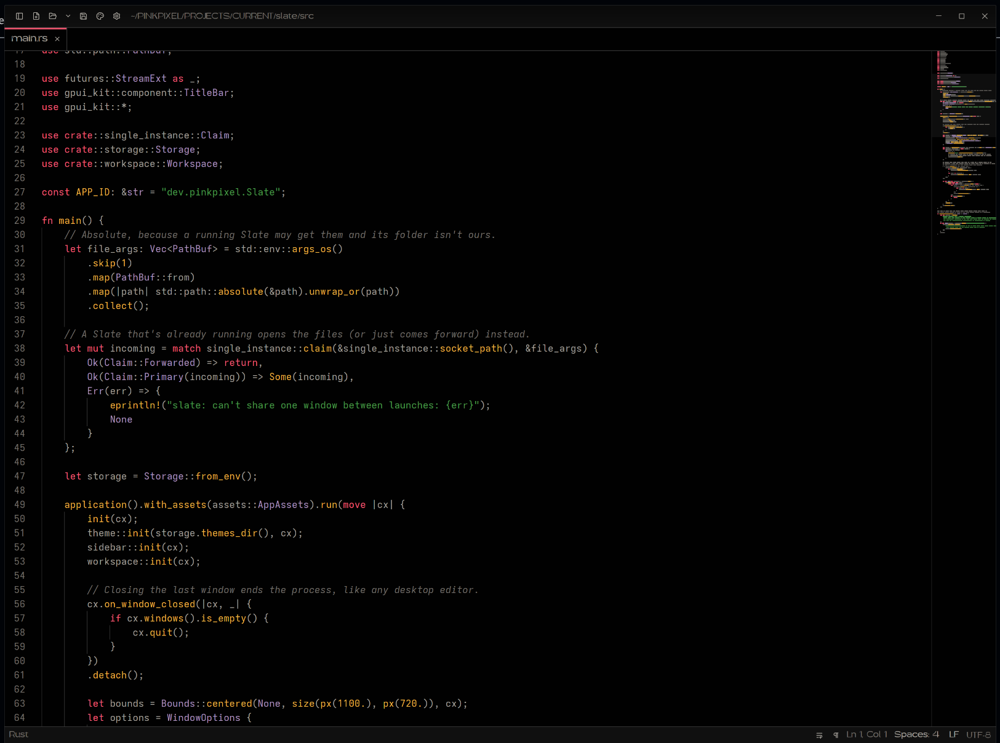

# Slate

**A fast, minimal text editor for Linux, built with GPUI Kit**



## Features

- Tabs: open as many files as you like, drag to reorder, middle-click to close
- Color-coded tabs: a thin colored line along the top of each tab makes it easy to find in a crowded row. By default, tabs cycle through the current theme's syntax colors, so they change with the theme. You can switch to coloring by language, or turn it off, in Settings. Right-click a tab to give it its own color (a preset or any custom color), which is remembered per file
- Open and save files with your desktop's native file dialogs, or from the terminal with `slate notes.md todo.txt`
- An Open Recent menu next to the Open button
- A file sidebar (`Ctrl+B`) for browsing a folder. It hides dotfiles and folders like `node_modules` until you ask for them, and it updates by itself when files change
- Syntax highlighting for 23 languages, picked automatically from the file name
- Line numbers, code folding, undo and redo, and multiple cursors (`Alt+Click`, or `Alt+Shift+Up/Down`)
- Line shortcuts: duplicate a line (`Ctrl+Shift+D`), move lines up or down (`Alt+Up/Down`), and comment or uncomment them (`Ctrl+/`). Comments use the right syntax for the language, and languages without line comments (HTML, CSS, Markdown) get each line wrapped instead
- Go to Line (`Ctrl+G`). Type `42`, or `42:10` to land on a column too
- Quick Open (`Ctrl+P`) for fuzzy-finding a file in the sidebar folder. With no folder open, it searches the folder of the file you're on
- Zoom the editor text with `Ctrl+=` and `Ctrl+-`, and `Ctrl+0` to reset. Zoom only lasts until you close Slate, so your real font size stays whatever Settings says
- A find and replace bar (`Ctrl+F`, `Ctrl+H`) with a match counter and a Match Case toggle. It starts at your cursor and selects the match it lands on
- Session restore: start Slate without any files and it reopens your last tabs and sidebar folder, unsaved edits included. Quitting doesn't nag you about unsaved tabs, because they'll be right there next time. You can turn this off in Settings
- Slate notices when an open file changes on disk. Tabs without edits just reload. If you have unsaved edits, a bar asks whether to reload or keep yours. A deleted file stays open, marked unsaved, so saving puts it back
- A dot by the file name when you have unsaved edits. Closing an unsaved tab asks Save / Don't Save / Cancel, and so does quitting when session restore is off or you opened Slate with files
- Word wrap (`Alt+Z`) and Show Whitespace toggles in the status bar, next to the cursor position and language
- Slate guesses each file's indentation (tabs or spaces, and how wide) and line endings when it opens. Both show in the status bar, and clicking them lets you switch. A CRLF file stays CRLF when you save, unless you change it there
- One Slate at a time: running `slate notes.txt` while Slate is already open adds a tab to that window instead of starting a second copy
- 37 built-in themes, including Slate Dark (charcoal surfaces with a muted cyan-blue accent), Catppuccin, Gruvbox, Tokyo Night, and Solarized. Switch from the palette button in the title bar
- A minimap (`Ctrl+Shift+M`) with syntax colors along the right edge. Click or drag it to move around. It hides while word wrap is on
- A live Markdown preview (`Ctrl+Shift+V`) that opens next to the editor and updates as you type
- A command palette (`Ctrl+Shift+P`) for running any command by name, with its shortcut shown next to it
- A settings panel (`Ctrl+,`) for the theme, interface and editor fonts, font sizes, word wrap, the minimap, session restore, tab color mode, and hidden files

Slate only opens UTF-8 text. Binary files and other encodings get an error message instead of loading as garbled text, so saving can't quietly damage them.

### Shortcuts

| Shortcut | Action |
|---|---|
| `Ctrl+N` | New file |
| `Ctrl+O` | Open |
| `Ctrl+S` | Save |
| `Ctrl+Shift+S` | Save As |
| `Ctrl+Shift+O` | Open folder |
| `Ctrl+B` | Show or hide the sidebar |
| `Ctrl+Shift+P` | Command palette |
| `Ctrl+P` | Quick Open |
| `Ctrl+G` | Go to Line |
| `Ctrl+Shift+V` | Markdown preview |
| `Ctrl+Shift+M` | Minimap |
| `Ctrl+,` | Settings |
| `Ctrl+W` | Close tab |
| `Ctrl+Tab` / `Ctrl+Shift+Tab` | Next / previous tab |
| `Ctrl+F` | Find |
| `Ctrl+H` | Find and replace |
| `F3` / `Shift+F3` | Next / previous match |
| `Ctrl+Shift+D` | Duplicate line |
| `Alt+Up` / `Alt+Down` | Move line up / down |
| `Ctrl+/` | Toggle comment |
| `Ctrl+=` / `Ctrl+-` / `Ctrl+0` | Zoom in / out / reset |
| `Alt+Z` | Word wrap |
| `Ctrl+Q` | Quit |

### Preferences

Your preferences live in `~/.config/slate/settings.json`, and custom themes go in `~/.config/slate/themes/`. Recent files and tab colors live in `~/.local/state/slate/state.json`, and your last session (including the text of unsaved tabs) lives in `~/.local/state/slate/session.json`. They're all plain JSON, so you can edit or delete them. Slate falls back to defaults if one is missing.

### Custom themes

Slate uses GPUI Kit's theme format. The easiest way to start is to copy one of the files from [`themes/`](themes) into `~/.config/slate/themes/`, rename the theme inside it, and edit the colors. The Open Folder button in Settings takes you straight there.

Slate watches that folder, so your changes show up as soon as you save the file. If you give your theme the same name as a built-in one, yours replaces it. If a file has a JSON mistake, you'll get an error notification telling you which file.

### Languages

Bash/Shell, C, C++, CSS, Diff, Go, HTML, Java, JavaScript, JSON, Lua, Makefile, Markdown, PHP, Python, Ruby, Rust, SQL, TOML, TSX, TypeScript, YAML, and Zig. Anything else opens as plain text.

## Install

On Arch and Arch-based distros (CachyOS, EndeavourOS, Manjaro), Slate is on the AUR as `slate-editor`. The name `slate` was already taken by a pixel art editor, and both install a `slate` command, so pacman won't let you have the two at once.

```bash
yay -S slate-editor
```

OR 

```bash
paru -S slate-editor
```

On anything else, build it yourself with the steps below.

## Requirements

- Linux with a Wayland or X11 session
- A working Vulkan driver
- Rust 1.92 or newer

I've only tested it on CachyOS with the COSMIC desktop so far. The file dialogs go through the XDG desktop portal, so you need a portal backend running (most desktops ship one).

On Arch-based systems, you probably already have the runtime libraries. If the build complains about something missing, these are the usual ones:

```bash
sudo pacman -S --needed base-devel vulkan-icd-loader libxkbcommon libxkbcommon-x11 wayland fontconfig openssl
```

If Slate prints "couldn't open a window" and exits, it couldn't find a Vulkan driver. Run `vulkaninfo --summary` to check. On Arch, the driver packages are `vulkan-radeon`, `vulkan-intel`, and `nvidia-utils`. Also check that `VK_LOADER_DRIVERS_SELECT` isn't set to a filter that hides your GPU's driver. Some desktop sessions set it to `*intel*` even on machines without the Intel Vulkan driver.

## Build and run

```bash
git clone https://github.com/pinkpixel-dev/slate.git
cd slate
cargo run --release
```

To open files straight away, pass them after `--`. A folder opens in the sidebar, and a path that doesn't exist yet opens as an empty file and gets created when you save:

```bash
cargo run --release -- path/to/file.md
```

The first build compiles a lot of dependencies, so it takes a few minutes. After that, rebuilds are quick.

## License

Apache 2.0. See [`LICENSE`](LICENSE).

The themes in `themes/kit/` come from [GPUI Kit](https://github.com/longbridge/gpui-kit) v0.7.1, which is also Apache 2.0.

Made with 💖 by [Pink Pixel](https://pinkpixel.dev)
